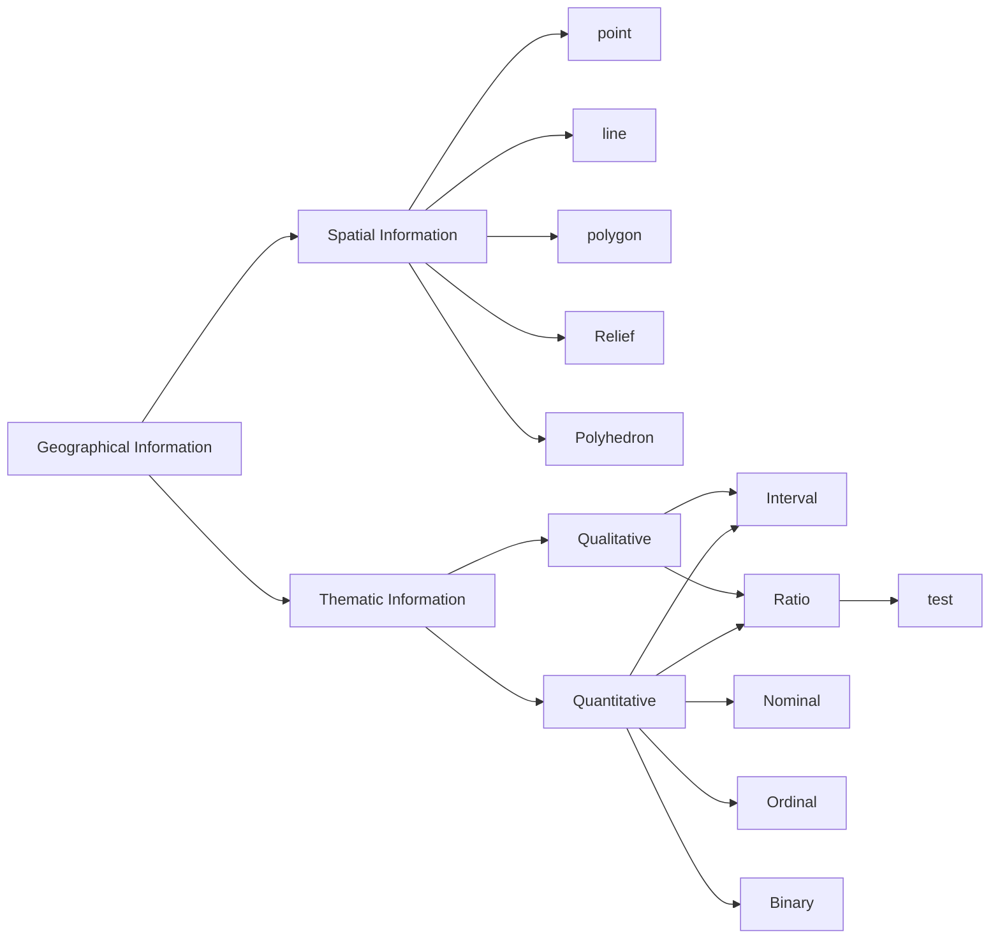

---
tags:
  - note
date: 2024-02-22
time: 02:12
status: draft
---

# [title:: Geographical Information | Type ]

[geographical_information](geographical_information.md) 的类型：

```mermaid
graph LR
gi[Geographical Information] --> si[Spatial Information] & ti[Thematic Information]

si --> point & line & polygon & Relief & Polyhedron
ti --> quan[Quantitative] & qual[Qualitative]
quan --> Interval & Ratio & Nominal & Ordinal & Binary
qual --> Interval & Ratio

Ratio --> test
```
