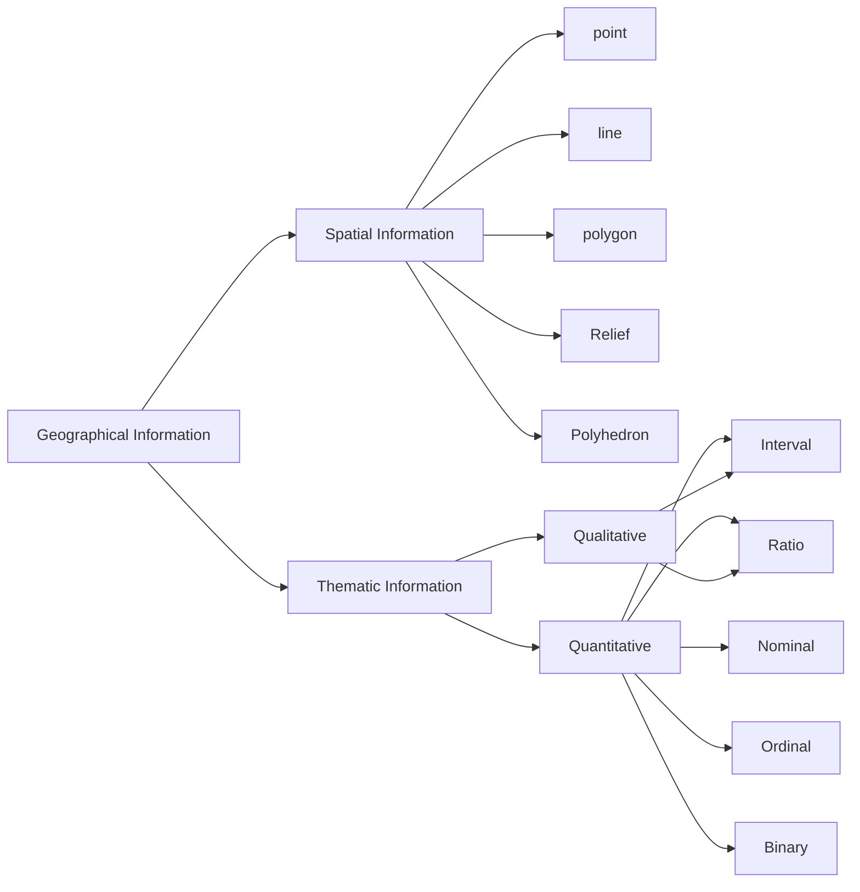

# [title:: Geographical Information | Type]

[geographical_information](geographical_information.md) 的类型：

## Interval（间隔尺度数据）

以有量纲的数据形式表示测度对象在某种单位（量纲）下的绝对量。

## Ratio（比例尺度数据）

以无量纲的数据形式表示测度对象的相对量。

## Ordinal（有序数据）

并非连续量，仅表示顺序关系的数据。

## Binary（二元数据）

用 0、1 两个数据表示某属性的是非判断。

## Nominal（名义数据）

表示某属性的状态或类型等。
