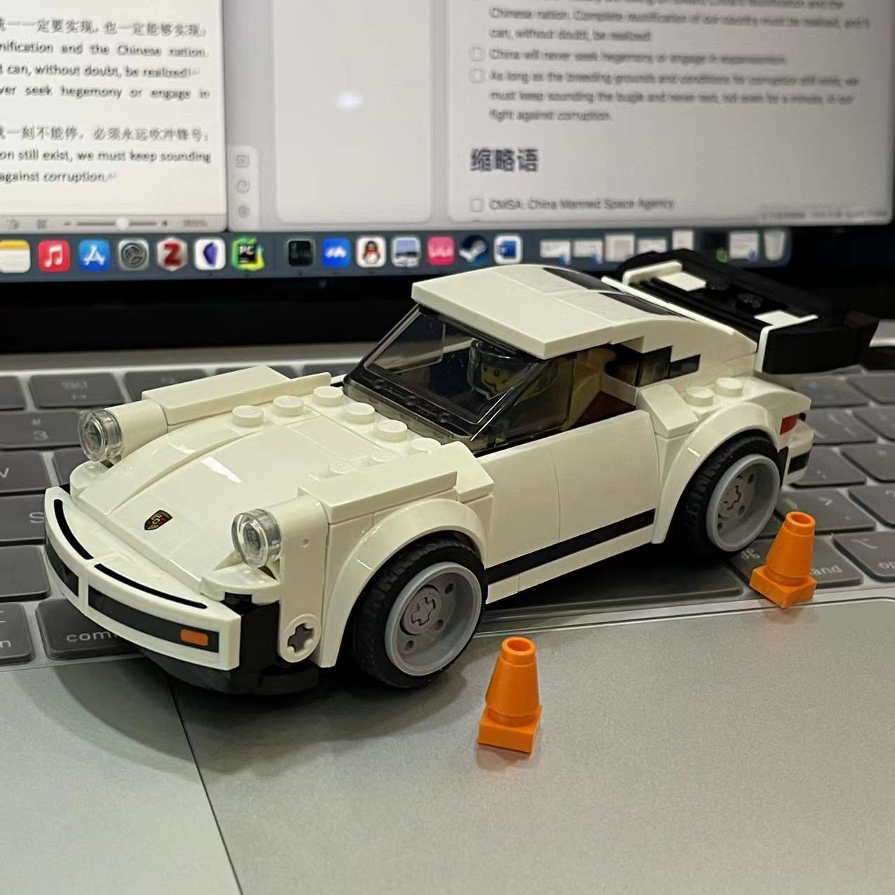

# Header 1

```
dawd
```

```text
dawd
```

## Header 2

### Header 3

#### Header 4

##### Header 5

###### Header 6

### Header with `code` , $\LaTeX$

### Header with **strong**, *italic*, ==highlight==

### Header with <u>underline</u>, ~~strikethrough~~

- dawdawd
    - dawdaw
        - dswdwd
- dawdaw
    - dawdawd
- dawdawdawd

1. dawdawd
    1. dawdaw
2. dwadawd
    1. dawdwd
3. dwadwadawd
    1. dawdwa
    2. awdawd

- [!] dawdawd
    - [x] dawddaw
    - [?] dawdw
        - [i] dawdwd
    - [-] dwadw
- [ ] dwadwa
- [ ] dwawd

Test paragraph. **Test** *paragraph*. <u>Test paragraph</u>. ~~Test paragraph~~. Test paragraph. `Test` $\LaTeX$ . 
$$
\LaTeX
$$
Test paragraph. ==Test paragraph==. Test paragraph. Test paragraph. Test paragraph. Test paragraph. Test paragraph. Test paragraph. Test paragraph. Test paragraph. Test paragraph. Test paragraph. Test paragraph. <strong>Test</strong> paragraph. Test paragraph. Test paragraph. Test paragraph. 

```text
Text Code. Text Code.Text Code.Text Code.Text Code.Text dd Code.Text Code.Text Code.Text Code.Text Code.Text Code.Text Code.Text Code.
```

```js
var pages = dv.pages(`"project" and #homepage`)

dv.table(["Name", "Status"],  // long line long line long line long line long line long line
	pages.map(p => [
		p.file.link,
		p.status,
	])
)
```

```html
<div> ok </div>
```

Test paragraph. Test paragraph. Test paragraph. Test paragraph. Test paragraph. Test paragraph. Test paragraph. *你好*

<u>nih</u>

> Quote block. Quote block. Quote block. Quote block. `Quote` block. Quote block. **Quote** block. *Quote* <u>block</u>. ==Quote== ~~block~~. Quote block. Quote block. Quote block. 
> 
> Quote block. Quote block. Quote block. Quote block. 
> > Nested Quote. Nested Quote. Nested Quote. Nested Quote. Nested Quote. Nested Quote. 
> > > ok
> > 
> > Nested Quote. Nested Quote. Nested Quote. Nested Quote. 
> 
> > [!note]
> > Callout in Quote.

> [!tip] Callout Title
> Callout. 
> 
> > Quote in Callout.
> 
> > [!error]
> > Nested Callout.

> [!error]
> ok
> > [!warning]
> > okk
> > > [!info]
> > > info

> [!warning]
> ok

> [!summary]
> sum

> [!info]
> info

> [!todo]
> todo

> [!important]
> important

> [!tip]
> tip

> [!done]
> done

> [!faq]
> faq

> [!caution]
> caution

> [!fail]
> fail

> [!error]
> error

> [!bug]
> bug

> [!example]
> example

> [!quote]
> quote

> [!none]
> none

> nih 

[test_page_2](test_page_2.md)

[test_page_2](no_exist_file.md)

[[no_exist_file]]

[[test_page_2]]

[dataview:: ok]

### [dataview:: okk]

dataview:: ok

this is (dataview:: ok).

#ok 

| dawd | dawdawd | 你好的啊我的啊我的啊我打我嗲的的啊我打我 |
| ---- | ---- | :--- | ---- |
| awdawd | awdawd 嗲 | 大文档 |

## #ok in Header

